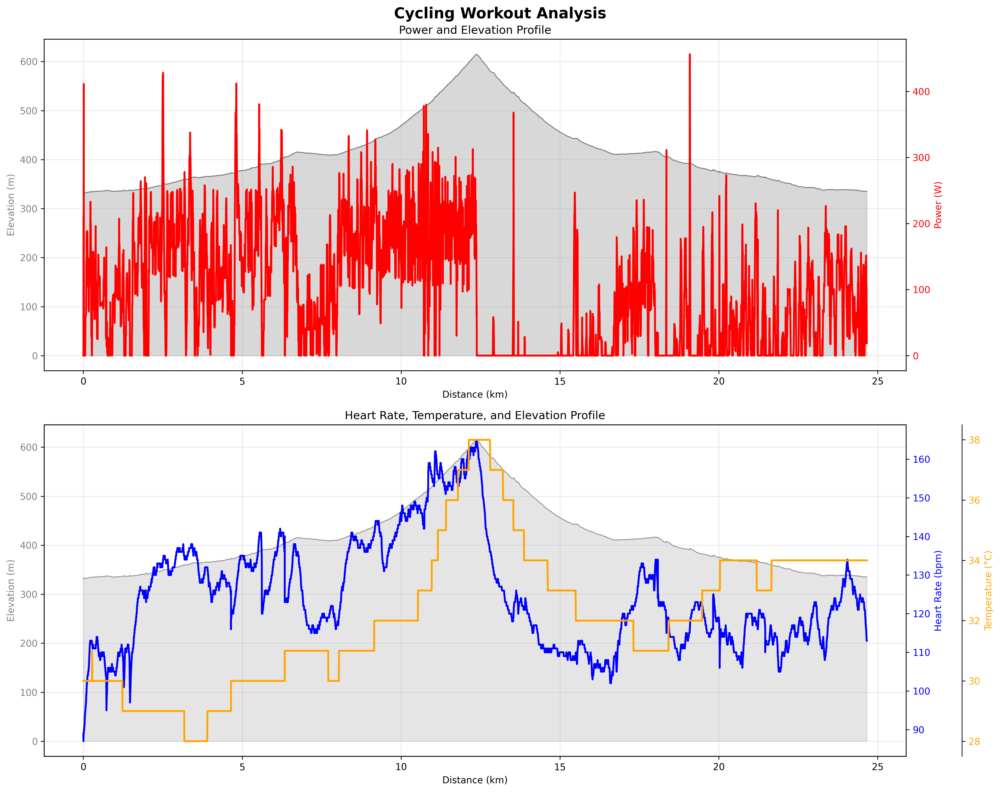

# Cycling Workout Analysis Report

*Generated on 2025-08-30 19:02:07*

**Bike Configuration:** 38t chainring, 20t cog, 22lbs bike weight
**Wheel Specs:** 700c wheel + 46mm tires (circumference: 2.49m)

## Basic Workout Metrics
| Metric | Value |
|--------|-------|
| Date | 2025-08-30 15:23:45 |
| Total Time | 1:21:54.557000 |
| Distance | 24.66 km |
| Elevation Gain | 303 m |
| Average HR | 128 bpm |
| Max HR | 165 bpm |
| Average Speed | 18.1 km/h |
| Max Speed | 49.1 km/h |
| Average Cadence | 61 rpm |
| **Enhanced Avg Power** | **143 W** |
| **Enhanced Max Power** | **456 W** |
| Power 95th Percentile | 260 W |
| Power 75th Percentile | 196 W |
| Temperature Range | 28°C - 38°C (avg 32°C) |
| Calories | 794 cal |

## Heart Rate Zones
*Based on LTHR 170 bpm*

| Zone | Range (bpm) | Time (min) | Percentage |
|------|-------------|------------|------------|
| Z1 | 0-136 | 58.2 | 71.1% |
| Z2 | 136-148 | 12.3 | 15.0% |
| Z3 | 149-158 | 7.8 | 9.5% |
| Z4 | 159-168 | 3.6 | 4.4% |
| Z5 | 169+ | 0.0 | 0.0% |

## Enhanced Power Distribution
| Power Zone | Percentage | Time (min) |
|------------|------------|------------|
| Recovery (<150W) | 52.7% | 32.4 |
| Endurance (150-200W) | 23.5% | 14.5 |
| Tempo (200-250W) | 17.5% | 10.7 |
| Threshold (250-300W) | 4.8% | 2.9 |
| VO2 Max (>300W) | 1.5% | 1.0 |

## Workout Analysis Charts
Detailed charts showing power output, heart rate, and elevation profiles:

## Minute-by-Minute Analysis
| Min | Dist (km) | Avg Speed (km/h) | Avg Cadence | Avg HR | Max HR | Avg Gradient (%) | Elevation Δ (m) | Est Avg Power (W) |
|-----|-----------|------------------|-------------|--------|--------|------------------|-----------------|-------------------|
|  1 | 0.27 | 15.9 | 61 | 101 | 113 | 1.3 | 2.0 | 103 |
|  2 | 0.32 | 19.3 | 74 | 111 | 114 | 0.4 | 1.6 | 95 |
|  3 | 0.26 | 16.0 | 49 | 105 | 110 | 0.6 | 0.2 | 61 |
|  4 | 0.36 | 21.7 | 86 | 107 | 112 | -0.1 | -0.2 | 84 |
|  5 | 0.24 | 14.5 | 37 | 108 | 112 | 1.8 | 2.2 | 86 |
|  6 | 0.30 | 18.0 | 69 | 112 | 125 | 0.2 | 1.0 | 100 |
|  7 | 0.30 | 18.2 | 59 | 125 | 127 | 1.6 | 2.2 | 120 |
|  8 | 0.35 | 21.4 | 87 | 130 | 133 | 1.5 | 5.4 | 178 |
|  9 | 0.34 | 20.8 | 84 | 133 | 135 | 1.6 | 5.2 | 171 |
| 10 | 0.35 | 21.3 | 86 | 135 | 137 | 1.7 | 6.0 | 189 |
| 11 | 0.34 | 20.7 | 78 | 136 | 138 | 1.8 | 5.8 | 181 |
| 12 | 0.35 | 21.4 | 77 | 132 | 137 | 0.3 | 1.0 | 103 |
| 13 | 0.35 | 21.4 | 72 | 127 | 132 | 0.5 | 1.4 | 114 |
| 14 | 0.33 | 20.2 | 69 | 128 | 131 | 1.2 | 4.0 | 144 |
| 15 | 0.14 | 9.0 | 30 | 124 | 128 | 9.2 | 2.2 | 51 |
| 16 | 0.37 | 22.4 | 88 | 128 | 135 | 1.2 | 4.6 | 172 |
| 17 | 0.32 | 19.7 | 69 | 133 | 135 | 1.9 | 5.8 | 169 |
| 18 | 0.24 | 14.9 | 56 | 136 | 141 | 3.4 | 7.8 | 181 |
| 19 | 0.28 | 16.7 | 65 | 125 | 129 | -0.0 | 0.8 | 76 |
| 20 | 0.34 | 20.6 | 82 | 136 | 142 | 2.5 | 9.0 | 221 |
| 21 | 0.10 | 6.0 | 25 | 138 | 141 | 12.2 | 4.4 | 90 |
| 22 | 0.24 | 14.6 | 55 | 126 | 133 | 4.7 | 5.6 | 143 |
| 23 | 0.28 | 17.3 | 63 | 134 | 138 | 1.4 | 2.8 | 121 |
| 24 | 0.34 | 20.7 | 82 | 119 | 126 | -0.5 | -2.0 | 51 |
| 25 | 0.36 | 21.9 | 87 | 117 | 120 | -0.6 | -2.4 | 56 |
| 26 | 0.34 | 21.0 | 63 | 120 | 122 | -0.1 | 0.0 | 79 |
| 27 | 0.30 | 18.3 | 69 | 122 | 131 | 1.7 | 5.8 | 157 |
| 28 | 0.30 | 18.2 | 70 | 137 | 141 | 2.3 | 6.4 | 180 |
| 29 | 0.30 | 18.1 | 72 | 138 | 140 | 2.3 | 7.0 | 180 |
| 30 | 0.27 | 16.7 | 67 | 137 | 140 | 2.9 | 8.0 | 192 |
| 31 | 0.24 | 14.9 | 59 | 142 | 144 | 3.5 | 8.2 | 190 |
| 32 | 0.23 | 14.3 | 57 | 134 | 140 | 2.8 | 6.8 | 158 |
| 33 | 0.23 | 13.9 | 56 | 139 | 141 | 3.8 | 8.6 | 190 |
| 34 | 0.18 | 11.3 | 46 | 143 | 147 | 5.4 | 9.2 | 188 |
| 35 | 0.19 | 11.3 | 45 | 146 | 148 | 5.1 | 9.2 | 193 |
| 36 | 0.18 | 11.0 | 44 | 147 | 148 | 5.3 | 10.0 | 196 |
| 37 | 0.18 | 11.2 | 44 | 148 | 149 | 4.9 | 8.6 | 185 |
| 38 | 0.14 | 8.8 | 33 | 145 | 147 | 5.8 | 7.4 | 150 |
| 39 | 0.13 | 8.0 | 27 | 150 | 158 | 4.7 | 7.4 | 136 |
| 40 | 0.17 | 10.1 | 40 | 156 | 159 | 5.7 | 9.6 | 182 |
| 41 | 0.13 | 8.2 | 37 | 158 | 162 | 8.5 | 9.4 | 172 |
| 42 | 0.14 | 8.8 | 33 | 157 | 159 | 6.9 | 8.8 | 168 |
| 43 | 0.15 | 9.1 | 36 | 153 | 154 | 7.0 | 10.6 | 203 |
| 44 | 0.15 | 9.1 | 36 | 153 | 154 | 6.2 | 9.2 | 184 |
| 45 | 0.15 | 9.2 | 36 | 156 | 158 | 6.5 | 9.4 | 187 |
| 46 | 0.13 | 8.1 | 32 | 155 | 160 | 7.9 | 10.6 | 200 |
| 47 | 0.13 | 8.2 | 33 | 158 | 160 | 6.8 | 9.0 | 179 |
| 48 | 0.14 | 8.5 | 34 | 160 | 162 | 7.6 | 10.6 | 206 |
| 49 | 0.16 | 9.5 | 38 | 162 | 163 | 7.2 | 11.2 | 219 |
| 50 | 0.51 | 30.8 | 8 | 153 | 165 | -4.9 | -36.0 | 32 |
| 51 | 0.65 | 39.4 | 0 | 125 | 133 | -6.2 | -41.6 | 3 |
| 52 | 0.32 | 19.4 | 6 | 122 | 126 | -4.6 | -20.2 | 26 |
| 53 | 0.29 | 17.5 | 2 | 121 | 124 | -5.4 | -16.8 | 2 |
| 54 | 0.62 | 37.5 | 6 | 112 | 117 | -5.2 | -32.0 | 0 |
| 55 | 0.60 | 36.4 | 2 | 110 | 112 | -3.8 | -21.6 | 3 |
| 56 | 0.43 | 26.2 | 7 | 110 | 113 | -2.4 | -11.6 | 44 |
| 57 | 0.49 | 29.7 | 16 | 107 | 110 | -2.3 | -11.4 | 20 |
| 58 | 0.45 | 27.4 | 0 | 106 | 109 | -2.2 | -10.0 | 12 |
| 59 | 0.27 | 16.7 | 53 | 114 | 120 | 0.3 | 1.0 | 69 |
| 60 | 0.31 | 18.4 | 73 | 120 | 122 | 0.5 | 1.2 | 88 |
| 61 | 0.32 | 19.5 | 74 | 129 | 133 | 0.5 | 1.8 | 99 |
| 62 | 0.31 | 18.6 | 68 | 129 | 130 | 0.7 | 2.4 | 107 |
| 63 | 0.11 | 6.9 | 12 | 129 | 134 | 6.7 | -1.2 | 9 |
| 64 | 0.26 | 15.6 | 9 | 120 | 124 | 4.9 | -7.6 | 18 |
| 65 | 0.33 | 19.5 | 12 | 115 | 119 | 2.8 | -11.0 | 4 |
| 66 | 0.41 | 25.0 | 28 | 112 | 117 | -0.0 | -3.4 | 78 |
| 67 | 0.47 | 28.5 | 27 | 121 | 123 | -2.5 | -12.2 | 29 |
| 68 | 0.24 | 15.1 | 19 | 118 | 123 | 7.8 | -1.4 | 25 |
| 69 | 0.21 | 12.4 | 18 | 117 | 125 | 0.7 | -3.6 | 27 |
| 70 | 0.29 | 17.1 | 24 | 113 | 117 | -1.3 | -5.0 | 41 |
| 71 | 0.36 | 22.0 | 46 | 111 | 115 | -1.0 | -3.8 | 33 |
| 72 | 0.34 | 20.5 | 51 | 115 | 120 | -0.3 | -1.4 | 64 |
| 73 | 0.28 | 17.2 | 37 | 118 | 121 | 1.6 | -0.8 | 66 |
| 74 | 0.24 | 14.8 | 29 | 115 | 120 | 3.8 | -3.8 | 17 |
| 75 | 0.34 | 20.9 | 22 | 112 | 117 | -0.6 | -4.0 | 38 |
| 76 | 0.40 | 24.5 | 62 | 111 | 117 | -1.9 | -7.8 | 31 |
| 77 | 0.43 | 26.4 | 34 | 116 | 119 | -1.4 | -5.6 | 49 |
| 78 | 0.39 | 23.9 | 52 | 118 | 123 | -0.6 | -2.4 | 72 |
| 79 | 0.39 | 24.1 | 68 | 114 | 122 | -0.4 | -1.4 | 95 |
| 80 | 0.38 | 23.3 | 82 | 123 | 129 | -0.1 | -0.4 | 97 |
| 81 | 0.39 | 23.6 | 69 | 129 | 134 | -0.2 | -1.2 | 88 |
| 82 | 0.32 | 21.3 | 21 | 121 | 125 | -0.5 | -1.8 | 65 |

## Technical Notes
- Power estimates use enhanced physics model with temperature-adjusted air density
- Gradient calculations are smoothed over 5-point windows to reduce GPS noise
- Gear ratios calculated using actual wheel circumference and drive train specifications
- Power zones based on typical cycling power distribution ranges